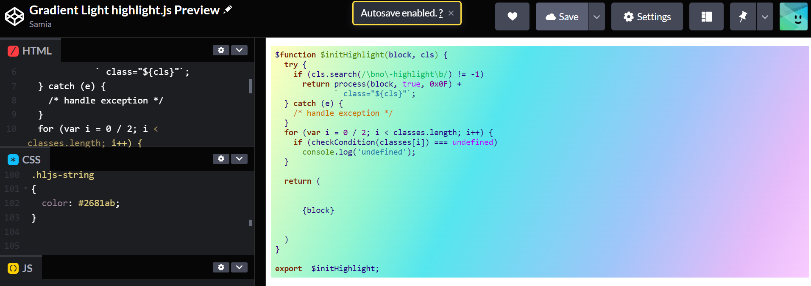

# Gradient Themes for [Highlight.js](https://highlightjs.org/)


A light and dark theme theme with a gradient color background for highlight.js

## Preview


Gradient Light. [Preview on codepen](https://codepen.io/samiaab1990/pen/XWavQKY)


Gradient Dark. [Preview on codepen](https://codepen.io/samiaab1990/pen/NWvQmRd)

## How To Use
Instructions on basic usage are available [here](https://highlightjs.org/usage/).

To use in RMarkdown, use the following code in the beginning of the document

```
<style type="text/css">
@import "https://highlightjs.org/static/demo/styles/gradient-light.css";
</style>

<style type="text/css">
@import "https://highlightjs.org/static/demo/styles/gradient-dark.css";
</style>
```

## Maintainers
- [Samia](https://github.com/samiaab1990)
